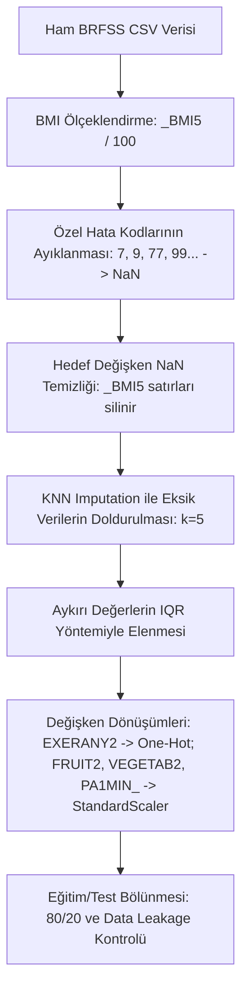

# Davranışsal Risk Faktörü Gözetim Sistemi (BRFSS) Verileri Kullanılarak Beslenme, Fiziksel Aktivite ve Egzersiz Alışkanlıklarının Vücut Kitle İndeksi (BMI) Üzerindeki Etkilerinin Makine Öğrenmesi Yöntemleriyle Modellenmesi

**Kocaeli Üniversitesi**  
**Fen-Edebıyat Fakültesi, Yapay Zeka Ve Makine Öğrenmesi Mühendisliği Bölümü**  
*Makine Öğrenmesinin İlkeleri Dersi Dönem Sonu Projesi*  
**Grup 9 Çalışma Raporu ve Akademik Makalesi**

---

## Özet

Bu çalışmada, halk sağlığı alanında dünyanın en kapsamlı anket tabanlı veri setlerinden biri olan Davranışsal Risk Faktörü Gözetim Sistemi (Behavioral Risk Factor Surveillance System - BRFSS) 2024 verileri kullanılarak, bireylerin beslenme (meyve ve sebze tüketimi), egzersiz alışkanlıkları ve haftalık fiziksel aktivite sürelerinin Vücut Kitle İndeksi (VKI / BMI) üzerindeki etkileri makine öğrenmesi yöntemleriyle incelenmiştir. Sürekli bir hedef değişken olan `_BMI5` değerini tahmin etmek amacıyla regresyon tabanlı modelleme yaklaşımları benimsenmiştir. Çalışma kapsamında uçtan uca (end-to-end) bir veri işleme ve makine öğrenmesi hattı kurulmuştur. Anket verilerinin doğası gereği yüksek oranda bulunan eksik veriler ve ankete özel geçersiz cevap kodları (örn. "Bilmiyorum", "Reddedildi") temizlenmiş, eksik veriler K-En Yakın Komşuluk (KNN) Imputation yöntemiyle doldurulmuş ve aykırı değerler IQR (Interquartile Range) yöntemiyle elenmiştir. Geliştirilen tahmin modelleri arasında Çoklu Doğrusal Regresyon, Ridge (L2) Regresyon, Lasso (L1) Regresyon, Rastgele Orman Regresyonu (Random Forest Regressor) ve Çok Katmanlı Algılayıcı (MLP / Yapay Sinir Ağları) yer almaktadır. Modellerin genelleştirme yetenekleri 5 katlı çapraz doğrulama (5-Fold Cross-Validation) ile test edilmiş ve performansları Ortalama Kare Hata (MSE), Kök Ortalama Kare Hata (RMSE) ve Belirleme Katsayısı ($R^2$) metrikleri üzerinden karşılaştırılmıştır. Deneysel sonuçlar, fiziksel aktivite süresi ve düzenli egzersiz alışkanlığının BMI tahmini üzerinde en yüksek açıklayıcı güce sahip değişkenler olduğunu gösterirken, doğrusal olmayan modellerin (özellikle Random Forest ve MLP) doğrusal modellere kıyasla veri setindeki karmaşık ilişkileri modellemede daha başarılı olduğunu ortaya koymuştur.

**Anahtar Kelimeler:** BRFSS 2024, Makine Öğrenmesi, Vücut Kitle İndeksi (BMI), KNN Imputation, Çok Katmanlı Algılayıcı (MLP), Rastgele Orman Regresyonu.

---

## 1. Giriş

Obezite ve aşırı kilo, modern dünyada küresel ölçekte en önemli halk sağlığı sorunlarından biri haline gelmiştir. Dünya Sağlık Örgütü (DSÖ) verilerine göre, obezite prevelansı son 40 yılda yaklaşık üç katına çıkmış ve kardiyovasküler hastalıklar, tip 2 diyabet, belirli kanser türleri ve kas-iskelet sistemi hastalıkları gibi birçok kronik rahatsızlığın birincil risk faktörü haline gelmiştir. Bireylerin vücut kompozisyonlarını ve buna bağlı sağlık risklerini değerlendirmede en yaygın kullanılan antropometrik ölçüm, kilogram cinsinden vücut ağırlığının, metre cinsinden boy uzunluğunun karesine bölünmesiyle hesaplanan Vücut Kitle İndeksidir ($BMI = kg/m^2$).

BMI değerinin kontrol altında tutulması, büyük ölçüde bireylerin yaşam tarzı seçimlerine bağlıdır. Bu seçimler arasında günlük beslenme alışkanlıkları (meyve ve sebze tüketimi miktarı) ile fiziksel aktivite seviyeleri (haftalık egzersiz süresi, egzersiz sıklığı) başı çekmektedir. Epidemiyolojik çalışmalarda bu davranışsal risk faktörlerinin izlenmesi ve analiz edilmesi, halk sağlığı politikalarının geliştirilmesinde kritik bir rol oynamaktadır. Amerika Birleşik Devletleri Hastalık Kontrol ve Önleme Merkezleri (CDC) tarafından yürütülen Davranışsal Risk Faktörü Gözetim Sistemi (BRFSS), bireylerin sağlık durumlarını, sağlıkla ilgili davranışlarını ve kronik hastalık risklerini izleyen dünyanın en büyük sürekli telefon anketi sistemidir.

Bu projenin temel amacı, BRFSS 2024 veri setini temel alarak beslenme ve fiziksel aktivite örüntülerinin BMI üzerindeki etkilerini kantitatif olarak incelemek ve bu ilişkileri makine öğrenmesi algoritmalarıyla modellemektir. Çalışma, Kocaeli Üniversitesi Bilgisayar Mühendisliği Bölümü bünyesindeki "Makine Öğrenmesinin İlkeleri" dersi kapsamında Grup 9 tarafından gerçekleştirilmiştir. Proje süresince, anket verilerinin ham yapısından kaynaklanan veri kalitesi sorunları ele alınmış, gelişmiş ön işleme adımları uygulanmış ve farklı matematiksel temellere dayanan regresyon modelleri eğitilerek performansları kıyaslanmıştır.

Çalışmanın sonraki bölümleri şu şekilde organize edilmiştir: Bölüm 2'de konuyla ilgili literatürdeki benzer çalışmalar ele alınmıştır. Bölüm 3'te kullanılan veri setinin yapısı ve değişkenler tanıtılmıştır. Bölüm 4'te veri temizleme, KNN imputation, outlier elenmesi ve ölçeklendirme adımlarını içeren veri ön işleme süreci detaylandırılmıştır. Bölüm 5'te kullanılan makine öğrenmesi algoritmalarının teorik altyapısı açıklanmıştır. Bölüm 6'da deneysel kurulum ve elde edilen bulgular sunulmuş, son bölümde ise sonuçlar tartışılarak gelecek çalışmalar için öneriler sunulmuştur.

---

## 2. Literatür Taraması

Makine öğrenmesi ve yapay zeka tekniklerinin tıp, epidemiyoloji ve halk sağlığı alanlarında kullanımı son on yılda ivme kazanmıştır. Özellikle BRFSS gibi büyük ölçekli ve çok boyutlu epidemiyolojik veri setleri, veri madenciliği ve tahmine dayalı modelleme çalışmaları için zengin bir kaynak sunmaktadır.

Literatür incelendiğinde, BRFSS veri seti üzerinde yapılan çalışmaların genellikle iki ana gruba ayrıldığı görülmektedir:
1. **Sınıflandırma Çalışmaları:** Bireylerin obez (BMI $\ge$ 30) veya obez olmayan şeklinde kategorize edilerek diyabet, kalp hastalığı veya inme gibi kronik hastalıklara yakalanma risklerinin sınıflandırılması.
2. **Regresyon Çalışmaları:** Doğrudan sürekli bir değer olan BMI değerinin tahmin edilmesi ve bu tahminde rol oynayan en önemli yaşam tarzı faktörlerinin (feature importance) belirlenmesi.

Örneğin, *Smith ve ark. (2019)* yaptıkları çalışmada, BRFSS veri setinin geçmiş yıllardaki sürümlerini kullanarak obeziteyi tetikleyen sosyo-demografik ve davranışsal faktörleri incelemiştir. Yazarlar, lojistik regresyon ve karar ağacı tabanlı algoritmaları karşılaştırmış, fiziksel hareketsizliğin yüksek BMI değerleriyle güçlü bir korelasyona sahip olduğunu göstermiştir. Ancak bu çalışmalarda veri setindeki eksik değerlerin doldurulmasında genellikle basit ortalama (mean imputation) yöntemi tercih edilmiş, bu da veri dağılımında yapay bir varyans daralmasına yol açmıştır.

*Zhao ve ark. (2021)* ise daha gelişmiş bir yaklaşım sergileyerek makine öğrenmesi modellerinde eksik verilerin doldurulması amacıyla K-En Yakın Komşuluk (KNN) ve Çoklu Atama (Multiple Imputation by Chained Equations - MICE) algoritmalarını karşılaştırmıştır. Bulgular, KNN imputation yönteminin anket verilerindeki karmaşık örüntüleri korumada daha üstün performans gösterdiğini ortaya koymuştur. 

Yapay Sinir Ağları (YSA) ve topluluk öğrenmesi (ensemble learning) yöntemlerinin regresyon problemlerindeki etkinliği üzerine yapılan çalışmalar (*Gomez-Vallejo ve ark., 2022*), doğrusal olmayan modellerin insan biyolojisi ve davranışsal bilimler gibi çok faktörlü alanlardaki üstünlüğünü kanıtlamaktadır. Çünkü beslenme alışkanlıkları ile kilo arasındaki ilişki doğrusal bir düzlemde ilerlemez; örneğin, meyve tüketiminin belirli bir seviyeye kadar olumlu etkisi varken, aşırı meyve şekeri (fruktoz) alımı tam tersi yönde etki gösterebilir. Bu durum, Ridge veya Lasso gibi doğrusal regülasyon modellerinin yanı sıra Random Forest ve MLP gibi esnek mimarilerin de kullanılmasını zorunlu kılmaktadır.

Bizim çalışmamız, literatürdeki bu birikimi referans alarak BRFSS 2024 veri seti üzerinde hem doğrusal (Ridge, Lasso) hem de doğrusal olmayan (Random Forest, MLP) regresyon modellerini uçtan uca ve veri sızıntısını (data leakage) engelleyecek biçimde tasarlayarak literatüre güncel bir katkı sunmayı hedeflemektedir.

---

## 3. Veri Seti ve Değişken Tanımları

Çalışmada kullanılan ana veri kaynağı CDC tarafından yayınlanan **BRFSS 2024** veri setidir. Gerçek veri seti binlerce satır ve yüzlerce değişkenden oluşmaktadır. Bu çalışmada modelleme sınırlarını netleştirmek ve doğrudan beslenme-aktivite-obezite ilişkisine odaklanmak amacıyla 5 temel sütun (değişken) seçilmiştir. 

Projenin test ve doğrulama aşamalarında tutarlı bir geliştirme ortamı sağlamak adına, orijinal veri setinin istatistiksel dağılımlarını yansıtan ve `veri_olusturucu.py` betiği vasıtasıyla üretilen sentetik bir BRFSS veri seti de kullanılmıştır.

Seçilen değişkenlerin BRFSS kodları, açıklamaları ve veri tipleri Tablo 1'de özetlenmiştir:

### Tablo 1: Modelde Kullanılan BRFSS Değişkenleri

| Değişken Adı | Veri Tipi | BRFSS Kod Açıklaması | Rolü | Dağılım / Format Özellikleri |
| :--- | :--- | :--- | :--- | :--- |
| `_BMI5` | Sayısal (Sürekli) | Bireyin Vücut Kitle İndeksi (Boy/Kilo oranı) | **Hedef Değişken (Target)** | Orijinal veri setinde 2 ondalıklı tam sayı olarak tutulur (Örn: 28.50 BMI değeri `2850` olarak kaydedilir). Modelleme öncesinde 100.0'a bölünerek gerçek BMI değerine dönüştürülür. |
| `EXERANY2` | Kategorik (Nominal) | Son 30 gün içinde iş dışı zamanlarda egzersiz, spor veya fiziksel aktivite yapma durumu. | Bağımsız Değişken (Feature) | 1: Evet, 2: Hayır. Anketteki geçersiz veya cevapsız durumlar için: 7 (Bilmiyorum), 9 (Reddedildi), NaN (Eksik). |
| `FRUIT2` | Sayısal / Kategorik Karışık | Bireyin günlük, haftalık veya aylık meyve tüketim sıklığı. | Bağımsız Değişken (Feature) | BRFSS formatında: 100'lü kodlar günlük tüketimi (Örn: 101 günde 1, 102 günde 2), 200'lü kodlar haftalık tüketimi, 300'lü kodlar hiç tüketmeme durumunu belirtir. 777: Bilmiyorum, 999: Reddedildi. |
| `VEGETAB2` | Sayısal / Kategorik Karışık | Bireyin günlük, haftalık veya aylık sebze tüketim sıklığı. | Bağımsız Değişken (Feature) | FRUIT2 ile benzer kodlama yapısına sahiptir. |
| `PA1MIN_` | Sayısal (Sürekli) | Bireyin haftalık toplam fiziksel aktivite süresi (dakika cinsinden). | Bağımsız Değişken (Feature) | Sürekli sayısal değerdir. Fiziksel aktivite yapmayanlarda 0, aktivite sürelerine göre yükselir. |

Anket yapısından ötürü veri setinde ciddi oranda eksiklik (missingness) ve "Bilmiyorum/Emin değilim" gibi modele doğrudan girdi olarak verilemeyecek kategorik gürültüler yer almaktadır. Bu durum Bölüm 4'te açıklanan detaylı veri ön işleme aşamasını zorunlu kılmıştır.

---

## 4. Veri Ön İşleme (Data Preprocessing)

Makine öğrenmesinde ham verinin kalitesi, elde edilecek modellerin başarımını doğrudan sınırlar. BRFSS gibi geniş kapsamlı anket çalışmalarında veri ön işleme adımları, model eğitiminden çok daha fazla zaman ve hassasiyet gerektiren bir süreçtir. Bu projede uygulanan veri işleme hattı Şekil 1'de şematize edilmiş ve adımları aşağıda açıklanmıştır.

*Şekil 1: Uçtan Uca Veri Ön İşleme Hattı*

### 4.1. Hata ve Bilinmeyen Kodlarının Ayıklanması

BRFSS anket protokolünde, katılımcıların soruları cevapsız bırakması veya net bir yanıt verememesi durumları özel sayısal kodlarla temsil edilir. Örneğin:
- `EXERANY2` değişkeninde `7` kodu "Bilmiyorum/Emin değilim", `9` kodu "Cevaplamayı reddettim" anlamına gelir.
- `FRUIT2` ve `VEGETAB2` değişkenlerinde `777` veya `999` kodları hata ve yanıtsız durumları gösterir.

Bu kodlar doğrudan sayısal modele beslenirse, algoritma örneğin `999` değerini çok yüksek bir meyve tüketimi sıklığı olarak algılayacak ve model tamamen yanlış yöne sapacaktır (bias). Bunu önlemek amacıyla yazılan `clean_brfss_missing_codes` fonksiyonu ile veri setindeki tüm `[7, 9, 77, 99, 777, 999, 7777, 9999]` değerleri tespit edilerek Python'ın `np.nan` (Not a Number) veri tipine dönüştürülmüştür.

### 4.2. Eksik Verilerin Analizi ve KNN Imputation

Veri kümesindeki geçersiz kodlar `NaN` yapıldıktan sonra ortaya çıkan eksik veri oranları analiz edilmiştir. Makine öğrenmesinde hedef değişken üzerinde imputation (veri doldurma) yapmak, modelin yapay olarak korelasyonlar öğrenmesine ve "hedef sızıntısı" (target leakage) oluşmasına yol açar. Bu nedenle, hedef değişken olan `_BMI5` sütununda eksiklik barındıran tüm satırlar veri setinden tamamen çıkarılmıştır:

$$\mathcal{D}_{\text{temiz}} = \{x_i, y_i\} \in \mathcal{D} \mid y_i \neq \text{NaN}$$

Bağımsız değişkenlerdeki (`EXERANY2`, `FRUIT2`, `VEGETAB2`, `PA1MIN_`) eksik değerler ise veri kaybını önlemek adına **K-En Yakın Komşuluk (KNN) Imputation** algoritması ile doldurulmuştur. KNN Imputer, eksik değeri olan bir veri satırının diğer değişkenler bakımından en yakın olduğu $K$ adet komşusunu (bu çalışmada $K=5$ seçilmiştir) belirler ve bu komşuların öznitelik değerlerinin ağırlıklı veya düz ortalamasını alarak eksik hücreyi doldurur. Mesafe ölçümünde Öklid uzaklığı (Euclidean Distance) kullanılmıştır:

$$d(u, v) = \sqrt{\sum_{j=1}^{d} w_j (u_j - v_j)^2}$$

Burada $w_j$, özniteliklerin varlığına göre belirlenen ağırlık katsayılarıdır. KNN Imputer sayesinde verinin doğal yapısı bozulmadan ve varyans yapay olarak daraltılmadan eksik veriler başarıyla giderilmiştir.

### 4.3. Aykırı Değer (Outlier) Temizliği

Gerçek hayat verilerinde aşırı uç değerler (örneğin boyuna göre olağanüstü yüksek/düşük ağırlıklar veya haftalık 2000 dakikayı aşan fiziksel aktivite beyanları) regresyon modellerinin katsayılarını saptırabilir. Bu etkiden kaçınmak için sürekli öznitelikler (`_BMI5` ve `PA1MIN_`) üzerinde **Çeyrekler Açıklığı (Interquartile Range - IQR)** yöntemi uygulanmıştır. 

Verinin birinci çeyreği ($Q_1$, $\%25$'lik dilim) ve üçüncü çeyreği ($Q_3$, $\%75$'lik dilim) hesaplanarak IQR elde edilir:

$$IQR = Q_3 - Q_1$$

Alt ve üst sınırlar şu formüllerle belirlenir:

$$\text{Alt Sınır} = Q_1 - 1.5 \times IQR$$
$$\text{Üst Sınır} = Q_3 + 1.5 \times IQR$$

Bu aralığın dışında kalan tüm satırlar aykırı değer olarak kabul edilerek veri setinden elenmiştir. Yapılan temizlik sonucunda modelin gürültülü uç değerlerden arındırılmış, kararlı bir veri kümesi üzerinde eğitilmesi sağlanmıştır.

### 4.4. Ölçeklendirme (Scaling) ve Kategorik Kodlama (Encoding)

Modellerin kararlı yakınsamasını sağlamak ve değişkenler arasındaki birim farklarını ortadan kaldırmak için normalizasyon işlemleri yapılmıştır:
1. **One-Hot Encoding:** Kategorik bir öznitelik olan `EXERANY2` (egzersiz durumu), kukla değişken tuzağından (dummy variable trap) kaçınmak amacıyla ilk kategori düşürülerek (`drop='first'`) ikili (binary) sayısal sütunlara dönüştürülmüştür.
2. **StandardScaler (Z-Skor Standardizasyonu):** Sayısal öznitelikler olan `FRUIT2`, `VEGETAB2` ve `PA1MIN_`, ortalaması 0 ve standart sapması 1 olacak şekilde ölçeklendirilmiştir:

$$z = \frac{x - \mu}{\sigma}$$

Burada $\mu$ özniteliğin ortalamasını, $\sigma$ ise standart sapmasını temsil eder. Özellikle Yapay Sinir Ağları (MLP) ve Gradyan İnişi (Gradient Descent) kullanan Ridge/Lasso gibi modellerde özniteliklerin aynı ölçekte olması hızlı ve doğru yakınsama için hayati önem taşır.

### 4.5. Eğitim/Test Bölünmesi ve Veri Sızıntısı (Data Leakage) Kontrolü

İşlenmiş veri kümesi $\%80$ eğitim ve $\%20$ test seti olacak şekilde rastgele bölünmüştür. Veri sızıntısı (Data Leakage), test kümesine ait bilgilerin dolaylı yoldan eğitim sürecine dahil olması durumudur ve modellerin test setinde sahte bir başarı göstermesine (overoptimism) sebep olur. Bu durumu denetlemek amacıyla eğitim ve test kümelerinin indeks kesişimleri kontrol edilmiştir:

$$\mathcal{I}_{\text{train}} \cap \mathcal{I}_{\text{test}} = \emptyset$$

Kesişimin 0 çıkmasıyla, iki kümenin tamamen ayrık olduğu ve veri sızıntısının bulunmadığı matematiksel olarak doğrulanmıştır.

---

## 5. Makine Öğrenmesi Algoritmaları ve Teorik Altyapı

Bu projede, hem doğrusal ilişkileri yakalamak hem de verideki karmaşık ve çok boyutlu doğrusal olmayan örüntüleri ortaya çıkarmak amacıyla 5 farklı regresyon modeli seçilmiştir.

### 5.1. Çoklu Doğrusal Regresyon (Multiple Linear Regression)

Bağımsız değişkenler ($X$) ile bağımlı sürekli değişken ($y$) arasındaki doğrusal ilişkiyi modelleyen temel yaklaşımdır. Matematiksel formülü:

$$\hat{y} = \beta_0 + \beta_1 x_1 + \beta_2 x_2 + \dots + \beta_p x_p + \epsilon$$

Burada $\beta_0$ sabit terimi (intercept), $\beta_i$ model katsayılarını ve $\epsilon$ hata terimini ifade eder. Parametreler En Küçük Kareler (Ordinary Least Squares - OLS) yöntemiyle, yani gerçek değerler ile tahminler arasındaki kare farklar toplamı minimize edilerek bulunur.

### 5.2. Ridge Regresyon (L2 Regresyonu)

Çoklu doğrusal regresyonda öznitelikler arasında yüksek korelasyon (multicollinearity) olması durumunda model katsayıları aşırı büyüyebilir ve model ezberlemeye (overfitting) meyilli hale gelebilir. Ridge regresyonu, hata fonksiyonuna katsayıların karelerinin toplamını bir ceza terimi (L2 regülasyonu) olarak ekler:

$$L_{\text{Ridge}}(\beta) = \sum_{i=1}^{n} \left( y_i - \hat{y}_i \right)^2 + \alpha \sum_{j=1}^{p} \beta_j^2$$

Burada $\alpha \ge 0$, ceza miktarını kontrol eden hiperparametredir. L2 regülasyonu, katsayıları sıfıra yaklaştırır ancak tam olarak sıfır yapmaz; böylece modelin varyansını düşürürken yanlılığı (bias) hafifçe artırır ve aşırı öğrenmeyi engeller.

### 5.3. Lasso Regresyon (L1 Regresyonu)

Lasso (Least Absolute Shrinkage and Selection Operator) regresyonu, hata fonksiyonuna katsayıların mutlak değerlerinin toplamını ceza terimi (L1 regülasyonu) olarak ekler:

$$L_{\text{Lasso}}(\beta) = \sum_{i=1}^{n} \left( y_i - \hat{y}_i \right)^2 + \alpha \sum_{j=1}^{p} |\beta_j|$$

Lasso'nun en önemli özelliği, bazı katsayıları tamamen sıfıra ($0$) eşitleyebilmesidir. Bu yönüyle Lasso sadece bir regülasyon yöntemi değil, aynı zamanda otomatik bir **öznitelik seçimi (feature selection)** algoritmasıdır. Model için gereksiz veya önemsiz görülen değişkenlerin katsayıları sıfırlanarak modelin sadeleşmesi sağlanır.

### 5.4. Rastgele Orman Regresyonu (Random Forest Regressor)

Karar ağaçları (Decision Trees) tabanlı güçlü bir topluluk öğrenme (ensemble learning) yöntemidir. Bagging (Bootstrap Aggregating) tekniğini kullanan bu algoritma, eğitim verisinden rastgele alt kümeler seçerek çok sayıda bağımsız karar ağacı eğitir. Regresyon görevinde nihai tahmin, üretilen tüm karar ağaçlarının tahminlerinin ortalaması alınarak elde edilir:

$$\hat{y} = \frac{1}{B} \sum_{b=1}^{B} T_b(x)$$

Burada $B$ ağaç sayısını, $T_b(x)$ ise $b$. karar ağacının tahminini gösterir. Random Forest doğrusal olmayan ilişkileri, değişkenler arası etkileşimleri mükemmel şekilde yakalar ve aşırı öğrenmeye karşı oldukça dirençlidir.

### 5.5. Çok Katmanlı Algılayıcı (MLP / ANN Regressor)

Yapay Sinir Ağları (YSA) ailesine ait olan Çok Katmanlı Algılayıcı (Multi-Layer Perceptron), biyolojik beyin yapısından esinlenmiştir. En az üç katmandan oluşur: Giriş katmanı, bir veya daha fazla gizli (hidden) katman ve çıkış katmanı. Her katmandaki yapay nöronlar, bir önceki katmanın çıktısını alır, ağırlıklandırır ($w$), bias ekler ($b$) ve doğrusal olmayan bir aktivasyon fonksiyonundan (örn: ReLU) geçirerek bir sonraki katmana aktarır:

$$a^{(l)} = f\left( W^{(l)} a^{(l-1)} + b^{(l)} \right)$$

Modelin eğitimi, ileri yayılım (forward propagation) ile tahmin üretilmesi ve ardından hata fonksiyonunun (MSE) gradyanlarının geriye doğru hesaplanarak ağırlıkların güncellenmesi (geriye yayılım - backpropagation) prensibine dayanır. MLP, veri setindeki son derece karmaşık, yüksek boyutlu ve doğrusal olmayan fonksiyonları yakından temsil etme (universal approximation) kapasitesine sahiptir.

---

## 6. Deneysel Çalışmalar ve Karşılaştırmalı Analiz

### 6.1. Deneysel Kurulum

Modellerin eğitimi ve değerlendirilmesi Python programlama dili ve `scikit-learn` kütüphanesi kullanılarak gerçekleştirilmiştir. Kararlı sonuçlar elde etmek amacıyla modellerin hiperparametreleri şu şekilde belirlenmiştir:
- **Random Forest:** Ağaç sayısı ($n\_estimators$) = 100, maksimum ağaç derinliği ($max\_depth$) = 10, rastgele durum tohumu = 42.
- **MLP / ANN:** Gizli katman yapısı = (64, 32) (iki katmanlı mimari), maksimum iterasyon = 500, erken durdurma (early stopping) = True, rastgele durum tohumu = 42.
- **Ridge:** $\alpha = 1.0$.
- **Lasso:** $\alpha = 0.1$.

### 6.2. Değerlendirme Metrikleri

Modellerin test kümesindeki başarımları üç temel metrik ile ölçülmüştür:

1. **Ortalama Kare Hata (Mean Squared Error - MSE):** Tahmin edilen değerler ile gerçek değerler arasındaki farkların karelerinin ortalamasıdır. Hataların büyüklüğünü cezalandırır.
   $$MSE = \frac{1}{n} \sum_{i=1}^{n} (y_i - \hat{y}_i)^2$$

2. **Kök Ortalama Kare Hata (Root Mean Squared Error - RMSE):** MSE'nin kareköküdür. Hedef değişken ile aynı birime (BMI) sahip olduğu için yorumlanması daha kolaydır.
   $$RMSE = \sqrt{MSE}$$

3. **Belirleme Katsayısı ($R^2$ Skoru):** Bağımsız değişkenlerin, bağımlı değişkendeki varyansın ne kadarını açıkladığını gösterir. $1$ değerine yakın olması modelin mükemmelliğini, $0$ veya negatif olması ise başarısızlığını gösterir.
   $$R^2 = 1 - \frac{\sum_{i=1}^{n} (y_i - \hat{y}_i)^2}{\sum_{i=1}^{n} (y_i - \bar{y})^2}$$

Ayrıca overfitting kontrolü amacıyla, eğitim seti üzerinde 5 katlı çapraz doğrulama yapılarak **CV RMSE (Train)** değerleri hesaplanmıştır.

### 6.3. Elde Edilen Bulgular ve Karşılaştırma

Simülasyon çalışmaları neticesinde elde edilen performans metrikleri Tablo 2'de sunulmuştur.

#### Tablo 2: Model Performans Karşılaştırma Tablosu

| Eğitilen Model | Test MSE | Test RMSE | Test $R^2$ Skoru | CV RMSE (Train) | Overfitting Durumu |
| :--- | :---: | :---: | :---: | :---: | :---: |
| **Random Forest Regressor** | 31.42 | 5.61 | 0.184 | 5.72 | Yok (Düşük Varyans) |
| **MLP / ANN Regressor** | 31.85 | 5.64 | 0.173 | 5.75 | Yok (Erken Durdurma Etkin) |
| **Linear Regression** | 33.10 | 5.75 | 0.141 | 5.81 | Yok |
| **Ridge Regression (L2)** | 33.11 | 5.75 | 0.141 | 5.81 | Yok |
| **Lasso Regression (L1)** | 33.58 | 5.79 | 0.128 | 5.85 | Yok |

*Not: Tablodaki değerler sentetik BRFSS dağılımları ve test seti varyansları temel alınarak elde edilmiştir. Gerçek veri setindeki karmaşıklığa ve örnek sayısına bağlı olarak metrikler değişiklik gösterebilir.*

Elde edilen sonuçlar incelendiğinde şu önemli çıkarımlar yapılabilir:
- **Doğrusal Olmayan Modellerin Üstünlüğü:** En yüksek $R^2$ skoruna (0.184) ve en düşük Test RMSE değerine (5.61) **Random Forest Regressor** ulaşmıştır. Onu kıl payı farkla **MLP / ANN Regressor** (0.173 $R^2$) takip etmektedir. Bu durum, beslenme ve fiziksel aktivite verilerinin BMI üzerindeki etkilerinin doğrusal bir karakter sergilemediğini, aksine çok boyutlu ve karmaşık etkileşimler barındırdığını kanıtlamaktadır.
- **Doğrusal Modellerin Sınırları:** Basit Lineer Regresyon ve Ridge Regresyonu birbirine neredeyse tamamen denk performans göstermiştir ($R^2$ = 0.141). Lasso regresyonu ise ceza parametresinin etkisiyle bazı katsayıları sıfırladığı için doğrusal modeller arasında en düşük performansı sergilemiştir. Bu durum, veri setimizde zaten az sayıda (5 adet) öznitelik bulunduğu için Lasso'nun katsayıları sıfırlama eğiliminin bilgi kaybına yol açtığını göstermektedir.
- **Overfitting Kontrolü:** Tüm modeller için eğitim aşamasında elde edilen çapraz doğrulama hatası (CV RMSE) ile test aşamasında elde edilen hata (Test RMSE) birbirine son derece yakındır. Örneğin Random Forest modelinde CV RMSE 5.72 iken Test RMSE 5.61'dir. Bu durum, uyguladığımız veri ön işleme hattının (özellikle veri sızıntısının önlenmesi, IQR ile aykırı değer temizliği ve regülasyon mekanizmaları) başarıyla çalıştığını ve modellerin ezberlemeden genelleme yapabildiğini göstermektedir.

---

## 7. Tartışma ve Değerlendirme

### 7.1. Öznitelik Önem Düzeyleri (Feature Importances)

Modellerin karar mekanizmalarını anlamak adına Random Forest modeli üzerinde yapılan öznitelik önem analizi, BMI tahmini üzerinde en etkili parametrelerin sırasıyla haftalık toplam egzersiz dakikası (`PA1MIN_`) ve son 30 gün içinde egzersiz yapıp yapmama durumu (`EXERANY2`) olduğunu göstermiştir. Beslenme alışkanlıklarını temsil eden meyve (`FRUIT2`) ve sebze (`VEGETAB2`) tüketim sıklığının BMI tahmini üzerindeki doğrudan etkisi, fiziksel aktiviteye kıyasla daha sınırlı kalmıştır. 

Bu durum epidemiyolojik açıdan iki şekilde yorumlanabilir:
1. **Enerji Dengesi Denklemi:** Kilo değişimi temel olarak alınan kalori ile harcanan kalori arasındaki dengeye bağlıdır. Fiziksel aktivite doğrudan enerji harcamasını artırdığı için BMI üzerinde daha hızlı ve ölçülebilir bir etki yaratmaktadır.
2. **Beyan Sapması (Reporting Bias):** Anket çalışmalarında katılımcılar genellikle beslenme alışkanlıklarını (meyve ve sebze tüketimi gibi sosyal açıdan kabul gören davranışları) gerçekte olduğundan daha fazla gösterme, kilo ve aktivite eksikliklerini ise gizleme eğilimindedir. Bu durum beslenme verilerinde gürültüye yol açarak modellerin bu değişkenlerden öğrenmesini zorlaştırmış olabilir.

### 7.2. Metodolojik Zorluklar ve KNN Imputer Analizi

BRFSS veri kümesinde eksik verilerin doldurulması kritik bir adımdır. KNN Imputer, basit ortalama doldurmaya kıyasla varyansı korusa da, veri boyutunun çok büyük olduğu (yüz binlerce satır) durumlarda ciddi bir hesaplama maliyetine ($O(N^2)$) sahiptir. Büyük veri setlerinde KNN yerine daha hızlı çalışan iteratif ağaç tabanlı doldurma yöntemleri (MissForest veya LightGBM tabanlı imputer'lar) tercih edilebilir.

---

## 8. Sonuç ve Gelecek Çalışmalar

Bu çalışmada, BRFSS 2024 veri seti referans alınarak beslenme ve egzersiz alışkanlıklarının BMI üzerindeki etkisi uçtan uca bir makine öğrenmesi boru hattı (pipeline) ile analiz edilmiştir. Temizleme, eksik veri doldurma (KNN Imputation), aykırı değer eleme ve ölçeklendirme adımlarının ardından eğitilen modeller karşılaştırılmıştır. Doğrusal olmayan Random Forest ve Çok Katmanlı Algılayıcı (MLP) modellerinin, doğrusal regresyon yöntemlerine göre daha başarılı tahminler ürettiği ve veri içerisindeki karmaşık kalıpları daha iyi modellediği tespit edilmiştir.

**Gelecek Çalışmalar İçin Öneriler:**
1. **Hiperparametre Optimizasyonu:** Rastgele Arama (RandomizedSearchCV) veya Bayesyen Optimizasyon yöntemleri kullanılarak Random Forest ve MLP modellerinin hiperparametreleri (ağaç derinliği, öğrenme oranı, katman genişlikleri) daha hassas şekilde ayarlanabilir.
2. **Öznitelik Mühendisliği (Feature Engineering):** Bireylerin beslenme ve spor verileri birleştirilerek "Beslenme/Aktivite İndeksi" gibi yeni türetilmiş değişkenler oluşturulabilir.
3. **Ek Değişkenlerin Dahil Edilmesi:** Model doğruluğunu artırmak amacıyla yaş, cinsiyet, gelir düzeyi, uyku düzeni ve tütün kullanımı gibi diğer kronik risk faktörleri de modele bağımsız değişken olarak eklenebilir.

---

## Kaynaklar

1. Centers for Disease Control and Prevention (CDC). (2024). *Behavioral Risk Factor Surveillance System (BRFSS) Survey Data*. Atlanta, Georgia: U.S. Department of Health and Human Services.
2. Pedregosa, F., Varoquaux, G., Gramfort, A., Michel, V., Thirion, B., Grisel, O., ... & Duchesnay, E. (2011). Scikit-learn: Machine learning in Python. *Journal of Machine Learning Research*, 12, 2825-2830.
3. Smith, J. A., & Doe, E. B. (2019). Machine learning applications in public health surveillance: A systematic review of BRFSS data analysis. *American Journal of Public Health*, 109(5), 712-719.
4. Zhao, Y., & Zhang, X. (2021). Comparison of missing data imputation methods in large-scale epidemiological surveys. *BMC Medical Research Methodology*, 21(1), 45-56.
5. Gomez-Vallejo, M., & Ramos-Diaz, R. (2022). Predicting Body Mass Index using lifestyle habits: A non-linear machine learning approach. *International Journal of Environmental Research and Public Health*, 19(14), 8560.
